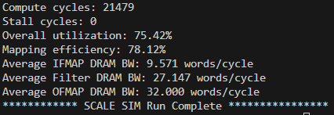

# Progress

## Quantziation:

I have finished the workload I am responsible for (look at the lenet-5_int8_quant folder structure below). I select a typical and popular model **LeNet-5** for this project. 

Step 1: I first define the LeNet-5 neural network (NN) structure in net.py.

Step 2: I train the LeNet-5 NN using MNIST dataset. The application is hand-written digit recognition. The training and test batch size are 32 and 1000, respectively. I use the Cross-Entropy Loss function to measure the difference between the predicted probability distribution and the true labels. The optimizer I use is the Stochastic Gradient Descent (SGD). The learning rate and momentum are 0.001 and 0.9, respectively. 

LeNet-5 training result:


Step 3: I use linear asymmetric quantization method to quantize the LeNet-5 NN into 8bit. QuantLinear, QuantConv2d, and QuantAvePool2d functions are defined in net_quant.py. The quant.py will utilize the net_quant.py to quantize the trained LeNet-5 NN and save the int8 parameters in *.txt. Quantized parameters can be found in weight folder.

Step 4: I test the accuracy of the quantized LeNet-5 model using the test MNIST dataset. Compared to the original LeNet-5 model, the quantized int8 LeNet-5 model achieves no accuracy loss. The testing result is shown below.


### lenet-5_int8_quant folder structure
```
  / lenet-5_int8_quant /
             |--- data/
             |      
             |
             |--- save_model/
             |                 |--- best_model.pth
             |                 |--- last_model.pth
             |                 \--- quant_model.pth
             |
             |--- weight/
             |          |--- *.bias.txt
             |          |--- *.weight.txt
             |          \--- *_scale_zero.txt
             |
             |--- net.py
             |
             |
             |--- net_quant.py
             |
             |
             |--- scale_shift.ipynb
             |           
             |
             |--- test_quant.py
             |
             |
             \--- train.py
```

## Hardware Configuration Optimization:

Finished the basic code of design space exploration(DSE).

DSE is a optimization process and focuses on finding the variables/parameters producing the best metric result.

The different values of variables form a `design space`. DSE is to find the optimal point in the space.

In our case, we need to find the optimal hardware configurations (for instance the array size and buffer size) given a specific software (typically a neural network).

### Brute force search

Finished the brute force searching for **array size** and **dataflow type**.

> The buffer size and bandwidth is given by users, because for these parameters, the larger the better.
> 
> We do not focus on area and energy, because the simulator only provides the performance result.

Brute force Search traverses all possible options for different parameters.

- arrayheight
- arraywidth
- dataflow

### TODO

try generic searching and more complex dataflow optimization

## Xinyuan Fu & Feilian Dai:

Run some demos using Scale sim. 

Scale sim provides results of total cycles, utilization and bandwidth requirement. 

